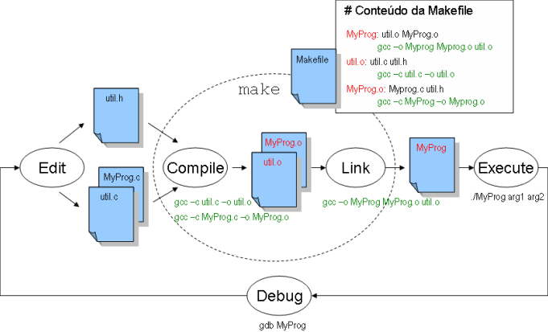

# Guião 1: Ferramentas de Desenvolvimento


## Objectivos

No final deste guião, deverá ser capaz de:

- Estar familiarizado com o ambiente UNIX.
- Utilizar a ferramenta `make` para gerar software.

*Nota: Os tutoriais práticos de SO consistem num conjunto de exercícios práticos que permitem aos alunos
familiarizarem-se com um determinado tema que será necessário para resolver os projetos da disciplina.
Os tutoriais podem ser resolvidos individualmente ou em grupo. A sua resolução é recomendada mas não
obrigatória. Não são avaliados.
Cada tutorial pressupõe que os exercícios são realizados numa interface de linha de comandos (shell) de
um sistema Unix/Linux ou equivalente. Assume também que os alunos já resolveram os tutoriais
anteriores.*

## Requisitos

- Sistema operativo Linux 20.04 LTS (se não o tiverem disponível no vosso computador pessoal, podem utilizar os computadores do laboratório);

## 1. Contacto com o ambiente UNIX

1. Clone este repositório, usando o git: `git clone git@github.com:tecnico-so/lab_ferramentas.git`.

2. Relembre o que fazem os comandos básicos como, por exemplo, `cd`, `ls`, `cat`, `cp`, `mv`, `rm`, `mkdir` e `rmdir`.
Recorde também que a generalidade dos comandos aceitam *flags* (também chamados
argumentos, opções ou *switches*) que modificam o seu comportamento. Compare, por exemplo, o
comportamento do comando `ls`, sem argumentos, com o comando `ls -l`.

Na secção seguinte detalha-se como pode obter ajuda ou informações sobre um certo comando em
ambientes UNIX.

## 2. Utilização do manual

1. Pode aceder a informação detalhada sobre comandos de sistema, programas e funções da linguagem C, usando o comando `man` (abreviatura de "manual"), sob a forma das chamadas *manpages*.

Por exemplo, para se informar sobre o uso do próprio comando `man` deve escrever:
```sh
man man
```

Para navegar nas páginas do manual podem ser usadas as setas do teclado e as teclas “PageUp” e
“PageDown”. Para sair do manual basta pressionar a tecla `q`.


2. O manual encontra-se organizado em secções numeradas de 1 a 9. Para a cadeira de Sistemas
Operativos, as secções mais relevantes são:

- Secção 1: comandos/utilidades da *shell*
- Secção 2: chamadas de sistema
- Secção 3: funções de bibliotecas (e.g., a biblioteca do C)

Isto é relevante pois existem comandos/funções com o mesmo nome que têm propósito e funcionamento diferentes.

Por exemplo, isso observa-se para o comando `printf` que está na secção 1 e a função `printf` da linguagem C que está na secção 3. Ao invocar o manual, pode especificar a que secção pretende aceder, indicando o seu número antes do nome. Experimente os seguintes comandos:
```sh
man printf
man 3 printf
```


3. O manual também contém informação sobre programas/ferramentas. Por exemplo, para
consultar a *manpage* do comando `zip`:
```sh
man zip
```

Outra forma de obter informação recorre directamente aos programas/ferramentas e ao uso
do *switch* `--help`, que é geralmente suportado:
```sh
zip --help
```

Experimente também usar o *switch* `--help` ou consultar a manpage dos seguintes programas: `gdb`, `gcc` e `make`[^footnote1].

[^footnote1]: No caso de programas como o (GNU) `make`, a sua documentação completa está apenas disponível como um manual *Texinfo*, acessível pelo comando `info`. Se quiser saber, por exemplo, como escrever um `Makefile`, a *manpage* do `make` recomenda consultar o manual completo com `info make`.


4. O uso do manual é especialmente útil para obter informação sobre as funções do C e identificar os valores devolvidos – notar a secção `RETURN VALUE`. Este aspeto é muito importante, pois nenhum programa deve chamar uma função e, no retorno, ignorar se ocorreu alguma situação de erro durante a execução da função. Como regra, antes de usar uma função, os alunos devem estudar nas *manpages*  as diversas situações de erro que podem ocorrer e assegurar que o
programa as trata devidamente (analisando o retorno da função).

## 3. Redireção dos canais de entrada/saída
1. Em ambientes UNIX, cada processo tem três canais fundamentais de entrada/saída: *stdin*, *stdout* e *stderr*.

- O `stdin` (“standard input”) representa o dispositivo de entrada de um programa - tipicamente o teclado;
- O `stdout` (“standard output”) representa o dispositivo de saída – tipicamente o terminal;
- O `stderr` (“standard error”) representa um dispositivo alternativo de saída para mensagens de erro, que, por defeito, é o mesmo dispositivo que o `stdout`.

2. É possível redirecionar qualquer um destes dispositivos para ficheiros usando redirection operators (`<`, `>`, `&>`, `>>`, ... ). Experimente executar os seguintes comandos, examinando o conteúdo da diretoria atual, e dos ficheiros referidos, após cada um deles:
```sh
echo Hello World
echo Hello World > my_stdout.txt
echo Hello again >> my_stdout.txt
echo Goodbye > my_stdout.txt
cat my_stdout.txt nonexistent_file
cat my_stdout.txt nonexistent_file 2> my_stderr.txt
cat my_stdout.txt nonexistent_file &> my_stdout_and_stderr.txt
cat < my_stdout.txt
```

**NOTA**: As sintaxes apresentadas em cima representam apenas alguns exemplos. Durante as aulas teóricas serão descritas formas mais genéricas de redirecionar os canais de Entrada/Saída dos processos Unix. No entanto, podem encontrar já detalhes sobre os *redirection operators* na secção `REDIRECTION` da *manpage* do *bash* (`man bash`) ou pesquisar informação na Internet.

3. É também possível redirecionar o `stdout` de um comando para o `stdin` de outro, criando assim uma cadeia de comandos para processar informação. Por exemplo, a seguinte cadeia de comandos lê o conteúdo do ficheiro `/etc/passwd`, filtra as linhas que contenham a palavra *root* e imprime a 7ª coluna (colunas separadas pelo caracter ‘:’) de cada linha:

```sh
cat /etc/passwd | grep root | cut -d : -f 7
```

Estas redireções são feitas com recurso a *pipes*, conceito que será abordado mais a fundo durante as aulas teóricas.

## 4. Análise do programa fornecido

Analise os ficheiros presentes na directoria `src` usando o editor de texto da sua preferência (e.g., `vim`, `emacs`, `nano`, `gedit`, `Sublime`, `lime`, `VSCode`).

A directoria contém os ficheiros `bst.c` e `bst.h` que implementam uma árvore de procura binária (*Binary Search Tree* – BST). Os elementos da árvore são representados por uma estrutura de dados que está declarada em `bst.h`. Na versão fornecida, os dados mantidos em cada nó da árvore consistem numa simples cadeia de caracteres (*string*).

A directoria contém também o programa test.c que permite testar a biblioteca `bst`.

1. Identifique as diferentes operações disponibilizadas em `bst.c`.
2. Analise o programa `test.c` e identifique que comandos podem ser usados e qual a sua sintaxe.

## 5. Geração e teste do programa `test`

1. Gere o programa `test` usando os seguintes comandos

```sh
gcc -c bst.c -o bst.o
gcc -c test.c -o test.o
gcc test.o bst.o -o test
```

2. Execute o programa `test` e introduza os comandos abaixo. Analise os resultados obtidos.

```sh
./test

d
a 20
a 10
a 30
a 40
a 35
a 22
a 5
a 37
s 27
s 5
r 35
q
```

3. Execute os comandos abaixo e, analisando o conteúdo dos ficheiros `tree1.txt` e `tree2.txt`, interprete os resultados obtidos.

```sh
./test < tree1.txt
./test < tree2.txt
```

## 6. Utilização da ferramenta make
O `make` é uma ferramenta frequentemente utilizada para compilar software. Em projetos de qualquer dimensão, a utilização do `make` oferece uma forma unificada e conhecida de compilar o software em questão.

A documentação completa da ferramenta make pode ser consultada no link [http://www.gnu.org/software/make/manual/make.html](http://www.gnu.org/software/make/manual/make.html).

O `make` necessita de um ficheiro, habitualmente chamado `Makefile`, que descreve uma série de alvos (*targets*) e respetivas dependências.

Normalmente, tanto os alvos como as dependências são ficheiros: os alvos são ficheiros que se pretendem gerar, enquanto que as dependências são ficheiros de código-fonte. Note que um alvo pode ser uma dependência de outro alvo, sendo estes casos resolvidos automaticamente.

Para além dos alvos e das suas dependências, o ficheiro `Makefile` deve incluir também os comandos (receitas) que permitem gerar os alvos a partir das dependências. Os comandos das receitas têm, obrigatoriamente, de estar numa linha que começa com um *tab*. Ao conjunto de alvo, dependências e receita chama-se `regra`, e a sua estrutura geral é:

```make
alvo1: dependencia1 dependencia2 dependencia3...
	comando1
	comando2
	...
```

O `make` é, em particular, útil para compilar software pois é capaz de, a partir das dependências descritas na `Makefile`, determinar quais os ficheiros (alvo) que estão desatualizados e precisam de ser recompilados. Isto torna-se muito vantajoso durante o desenvolvimento de um projeto de dimensão considerável pois poupa tempo de compilação.

Quando as dependências são mais recentes do que os alvos, ou quando os alvos não existem, o `make` volta a executar as receitas. Deste modo, quando um ficheiro fonte é atualizado, basta executar `make` para que todos os passos necessários até à geração do executável sejam realizados.

A Figura 1 ilustra a geração de um programa genérico `MyProg` a partir do ficheiro `MyProg.c` e dos ficheiros `util.c` e `util.h`.



1. Faça o paralelo entre o exemplo genérico descrito na Figura 1 e os comandos executados anteriormente no ponto 5.1.
2. O repositório já inclui um ficheiro `Makefile`. Analise o seu conteúdo e identifique quais as regras existentes. Notar o uso de variáveis, com atribuição de valor: ``CFLAGS = -g -Wall -std=c17`` e acesso ao seu conteúdo: ``$(CFLAGS)``
3. Execute os comandos seguintes para simular uma alteração em `test.c` e corra o programa `make` (o qual seguirá as instruções contidas no ficheiro `Makefile`). Interprete o que acontece.

```sh
touch test.c
make
```

4. Execute os comandos seguintes e interprete o que acontece.

```sh
make
touch bst.h
make
```

5. Notar que algumas regras não possuem dependências. Verifique o que acontece quando corre os
comandos seguintes.


```sh
make clean
make
make run1
```

6. Experimente agora correr os comandos abaixo. Qual a razão para a invocação do `make` não apagar os artefactos de compilação como anteriormente? Estude o conceito de *phony target* e tente usá-lo para evitar que o problema anterior se verifique.

```sh
touch clean
make clean
```

A ferramenta `make` é muito poderosa, sugerindo-se que explore melhor as suas capacidades lendo a respectiva documentação (ver *link* indicado no início desta secção). Salienta-se, em particular, que existem mecanismos que simplificam a escrita de *makefiles*, recorrendo ao uso de regras implícitas. Pode obter mais informação em: [http://www.gnu.org/software/make/manual/make.html#Implicit-Rules](http://www.gnu.org/software/make/manual/make.html#Implicit-Rules). Existem regras implícitas para a compilação de artefactos em C, o que é bastante útil nesta UC.

## 7. Extra

Se quiser explorar e exercitar mais aprofundadamente as ferramentas de compilação que vamos utilizar ao longo da UC, explore o [guião extra](advanced_makefile.md)


**NOTA IMPORTANTE:** Todas as entregas associadas à realização do projecto de SO deverão incluir os ficheiros fonte desenvolvidos e, obrigatoriamente, a correspondente `Makefile`.
